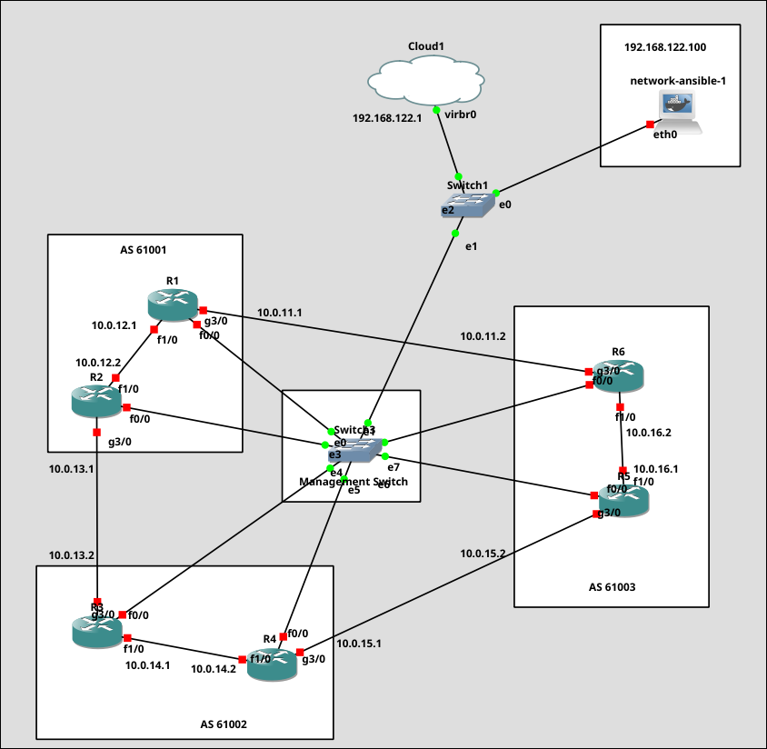

# Automated Network Configuration and Monitoring with Ansible, Prometheus & Grafana
This project automates the network configurations and monitoring of a simulated multi-AS network using *Ansible*, *SNMP*-monitoring, and real-time visualization using *Prometheus* and *Grafana*.

## Project Overview
**Tools & Technologies used:**
- GNS3: Network simulation platform for cisco routers
- Ansible: Network configuration and automation for OSPF/BGP
- Docker: Containerized Ansible Controller
- Bash/Python: Scripts for monitoring
- Prometheus: Router Metrics Collection
- Grafana: Router Metrics Visualization
- SNMP: Interface and status Monitoring

## Infrastructure Details
**Ansible Controller (Docker-Based)**
- Custom Docker container with:
    - `cron` pre-installed to run periodic scripts
    - GitHub auto-sync on startup to pull latest Ansible playbooks and scripts 
    - Mounted to GNS3 Cloud node for internet access and SSH reachability

**Network Topology**


| AS Number | Routers | IGP  | iBGP | eBGP |
| --------- | ------- | ---- | ---- | ---- |
| AS61001   | R1, R2  | OSPF | Yes  | Yes  |
| AS61002   | R3, R4  | OSPF | Yes  | Yes  |
| AS61003   | R5, R6  | OSPF | Yes  | Yes  |

## Monitoring Architecture

#### SNMP Configuration via Ansible
- Routers are configured via SNMP using playbooks
- SNMP metrics collected using `snmp_exporter` on host
- Periodic ping checks run via `cron` on Ansible Controller
- `run_ping_check.sh`:
    - pings each router from Anible Controller
    - saves results to `/tmp/ping_results/`
    - securely transfer the `.txt` router metrics to Prometheus host


#### Metrics Conversion Pipeline
- `txt_to_prometheus.py`:
    - converts the `.txt` router metrics to `.prom` format
    - output is then placed in `var/lib/node_exporter/textfile_collector/` for Prometheus to scrape


## System Configuration

**Node Exporter Setup on Prometheus Host:**
```bash
sudo dnf install node_exporter
sudo mkdir -p /etc/systemd/system/prometheus-node-exporter.service.d
sudo vim /etc/systemd/system/prometheus-node-exporter.service.d/override.conf
```
In override.conf:
```ApacheConf
[Service]
ExecStart=
ExecStart=/usr/bin/node_exporter \
  --collector.textfile.directory=/var/lib/node_exporter/textfile_collector
```
Then reload and restart prometheus:
```bash
sudo systemctl daemon-reexec
sudo systemctl daemon-reload
sudo systemctl node-exporter
curl http://localhost:9100/metrics | grep ping
```

## Prometheus Configuration

Install latest version from [Prometheus Github Releases](https://github.com/prometheus/prometheus/releases)

Once installed, navigate to the promethues.yml and append the node_export task:
```yaml
- job_name: "node_exporter"
  static_configs:
    - targets: ["localhost:9100"]
      labels:
        app: "node_exporter"
```
Start Prometheus:
```bash
./prometheus --config.file=prometheus.yml
```

## Grafana Dashboard
- installed via package manager `dnf`
- Data Source: Prometheus

## Automation Flow

1. `cron` on Ansible Controller runs `run_ping_check.sh` periodically every minute
2. Ping Router metrics `.txt` files saved in `/tmp/ping_results/`
3. Results securely copied to Prometheus Host via ssh
4. `txt_to_prometheus.py` parses the `.txt` files to `.prom` format for node-exporter
5. Node Exporter reads the `.prom` files via textfile collector
6. Promethues scrapes metrics from Node Exporter
7. Grafana visualizes the results using custom panels

## TO-DO / Improvements
- Finalize Grafana dashboards (custom panels need fixing)
- Add alert Rules in Prometheus
- Export interface erros and traffic stats from SNMP

## License
[MIT License](LICENSE) 🐨
